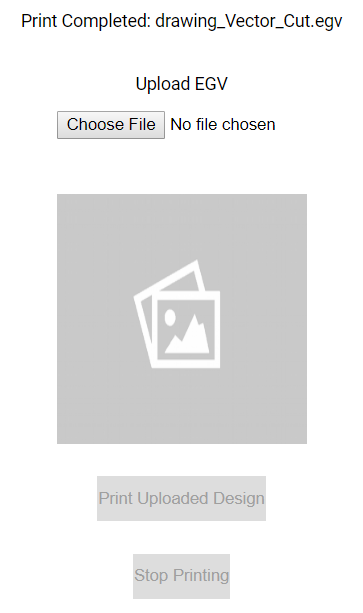

# K40WebServer
A webserver to allow controlling a K40 laser cutter over the network through an attached computer.

This is mostly a simple wrapper on the [K40Nano](https://github.com/K40Nano/K40Nano) interface. It copies some of the example scripts provided in [K40Tools](https://github.com/K40Nano/K40Tools).

Thanks to [tatarize](https://github.com/K40Nano/K40Tools/commits?author=tatarize) for doing the heavy lifting.

# Developement

This is currently a very minimal implementation. All it can do is upload an EGV file and start a print job.

## Major Toodos
  * Show progress
  * Allow stopping a print
  * Support SVG's
  * Improve UI
  * Add settings
  * Add homing, manual controls

# Usage

You can run the web server with the command:

`python -m k40webserver.WebServer`

Once it's running it can be accessed by entering `http://127.0.0.1:8081/` into your browser. With the proper firewall rules, or port forwarding other computers can reach the LAN or WAN address for the PC running the script as well.

You should see a web page like this:

The top line is the current status. This will indicate if the printer is busy, or the status of the last completed run.

The `Choose File` button will open up a file dialogue for uploading and EGV file. You will get an error if the file is invalid. If the file is valid you will see a preview below. Note that since the lines are 1 pixel thin, the preview may be hard to see.

Once a file is uploaded, you can press the `Print Uploaded Design` button to start the job. If there is a problem connecting to the printer, the status will indicate that the connection failed.

There is a stop button, but it doesn't currently function.
